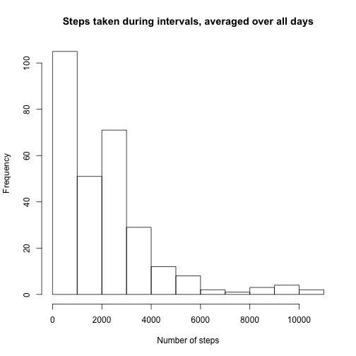
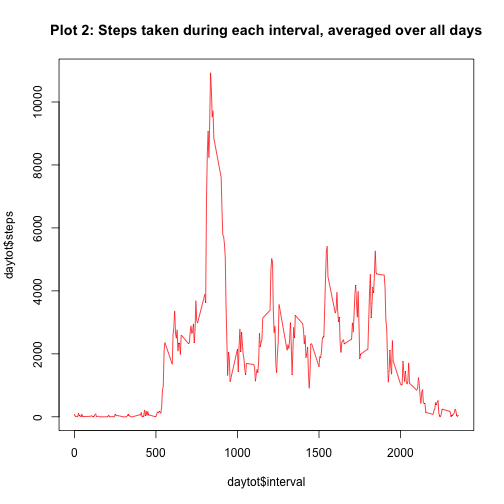
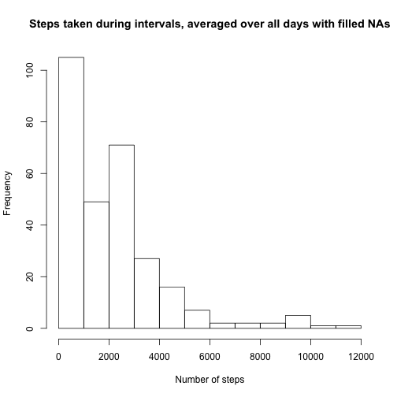
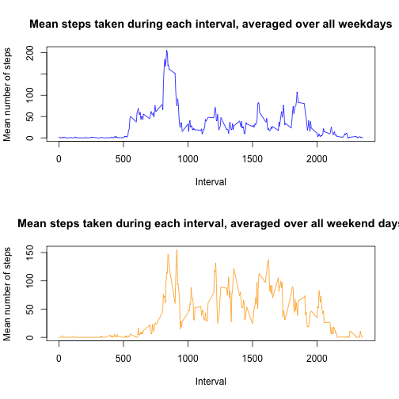

#Reproducible Research Project 1:  R Markdown

###Load required packages

```r
library(plyr)
library(lubridate)
library(knitr)
```

###Load Data

```r
myzipfile<-"repdata-data-activity.zip"
mycsvfile<-"activity.csv"
file_URL <- "https://d396qusza40orc.cloudfront.net/repdata%2Fdata%2Factivity.zip"
tempfile <- tempfile()
download.file(file_URL, tempfile, method = "curl")
unzip(tempfile)
unlink(tempfile)
mydata<-read.csv(mycsvfile)  #Read in as data.frame
mydata0<-mydata
```

###Processing Data

```r
mydata$date<-as.character(mydata$date)
mydata$date<-ymd(mydata$date)
```

###Drop cases with incomplete data

```r
goodrows<-complete.cases(mydata)
baddata<-mydata[!goodrows, ]
gooddata<-mydata[goodrows, ]
mydata<-gooddata
```

#What is mean total number of steps taken per day?
###Total steps per day

```r
dailytot<-ddply(mydata, .(date), summarize, steps= sum(steps) )
```

###Making Histogram of steps count for all intervals.

```r
daytot<-ddply(mydata, .(interval), summarize, steps=sum(steps))

hist(daytot$steps, main="Steps taken during intervals, averaged over all days", xlab="Number of steps", ylab="Frequency")
```



###Report mean and median

```r
(daysmean<-mean(dailytot$steps))
```

[1] 10766.19

```r
(daysmedian<-median(dailytot$steps))
```

[1] 10765

#What is the average daily activity pattern?

###Make time series plot (type "l") of interval vs average number of steps taken, averaged across all days.
###Produce plots.

```r
plot( daytot$interval, daytot$steps , type="l", col="red", main="Plot 2: Steps taken during each interval, averaged over all days")
```



###Report the 5-min interval with the maximum number of steps.

```r
( max(daytot$steps) )
```

[1] 10927

###Inputting missing values
###Calculate and report total number of missing values. We will use gooddata, baddata and goodrows from earlier

```r
(sum(!goodrows))
```

[1] 2304

```r
( percentbad<-sum(!goodrows)/sum(goodrows)*100 )
```

[1] 15.09434

###Calculate substitute values to fill in missing values
### Missing values will be filled in with the median for each interval. An alternative would be to fill them in with the mean for each interval. The mean will generally not be an integer number and it is more heavily influenced by instances when atypically many steps were taken, such as workout days.  
###Create new data set

```r
intervalmedian<-ddply(gooddata, .(interval), summarize, steps=median(steps))
baddata$steps<-NULL
baddataN<-merge( intervalmedian, baddata, by="interval")
gooddataN<-rbind(gooddata, baddataN)
mydata<-gooddataN
```

###Making Histogram of steps count for all intervals with filled in data

```r
daytot<-ddply(mydata, .(interval), summarize, steps=sum(steps))

hist(daytot$steps, main="Steps taken during intervals, averaged over all days with filled NAs", xlab="Number of steps", ylab="Frequency")
```



###Compare to part 1 histogram
###The histogram corresponding to the incomplete data has higher frequencies for the lower bins. 
###Compare total daily number of steps

```r
(sum(gooddata$steps))
```

[1] 570608

```r
(sum(gooddataN$steps))
```

[1] 579736

```r
(percentHigher<-sum(gooddataN$steps)/sum(gooddata$steps)*100)
```

[1] 101.5997

###Filling in the missing data increased the total daily number of steps and the frequencies at various intervals since filling in the missing values effectively replaces 0 step counts with the median values for each interval. However, the variability of the histogram (shape), doesn't change notably.

###The mean number of steps changed because the NA values were filled with the median values. If we had filled in with the mean, then the mean would be equal for the filled in data set.

#Are there differences in activity patters between weekdays and weekends?

###Create factor variables "weekday" and "weekend"

```r
mydata$dayType<- ifelse(wday(mydata$date) %in% c(1,7), "weekend", "weekday" )
mydata$dayType<-as.factor(mydata$dayType)
```

###Make panel plot containing time series plot of interval vs ave number of steps taken. Top plot is averaged over all weekdays, and bottom plot is average over all weekend days

```r
daymean<-ddply(mydata, .(interval, dayType), summarize, steps= mean(steps) )
weekdaymean<-daymean[daymean$dayType=="weekday", ]
weekendmean<-daymean[daymean$dayType=="weekend", ]
```

##Make double plot for weekdays and weekend days

```r
par(mfrow=c(2,1))
plot( weekdaymean$interval, weekdaymean$steps , type="l", col="blue", main="Mean steps taken during each interval, averaged over all weekdays", xlab="Interval", ylab="Mean number of steps")
plot( weekendmean$interval, weekendmean$steps , type="l", col="orange", main="Mean steps taken during each interval, averaged over all weekend days", xlab="Interval", ylab="Mean number of steps")
```



##Yes, there is higher variability (less flat) on weekdays, suggesting that there are times of high activity and times of low activity during weekdays, whereas on weekends there is an overall medium level of activity. 

